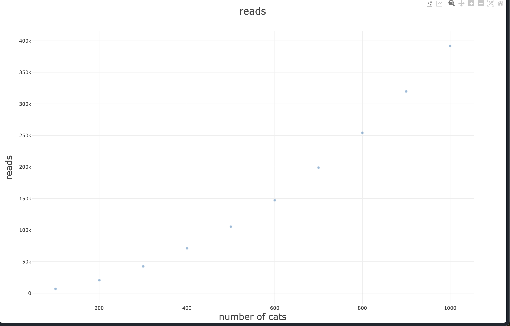
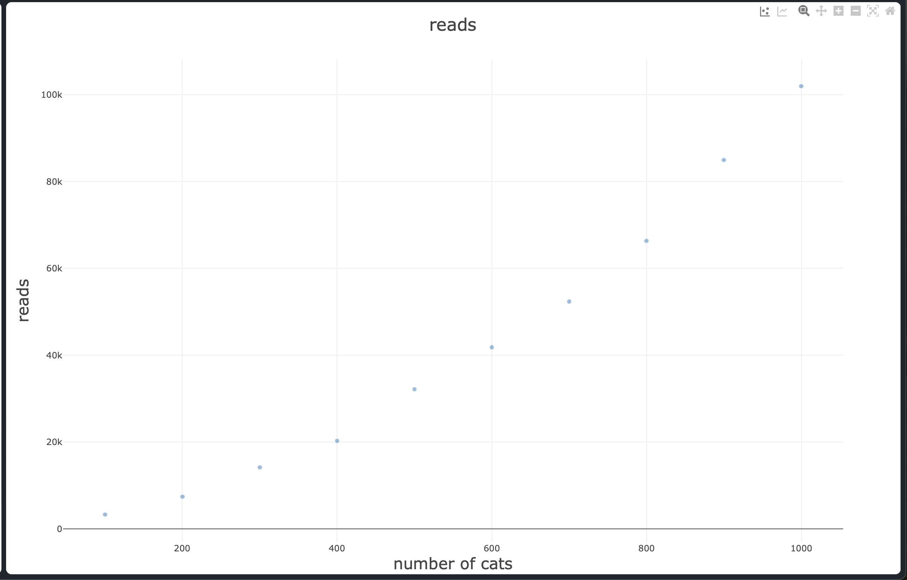

# Project 4 Report

  

Answer the following prompts directly in this file:

* Information about your dataset (you will be assigned a different grader for this project).

  

My dataset is about cats.

EX:

Id, Breed, Age (Years), Weight (kg), Color, Gender

1, Russian Blue, 19, 7, Tortoiseshell, Female

  
  

* Analyze the data. Graph the number of reads and allocations for each sorting algorithm and look at how the number of reads and allocations grows when the size of the data set grows. Compare and contrast the different sorting algorithms and draw conclusions about which sorting algorithms are more efficient. Discuss complexities and their effects.

  
  

# Bubble sort:

	

From the graphs it looks like it has O(1) auxiliary complexity and O(n^2) time complexity.

It's pretty inefficient on large inputs, but at least it takes the same amount of memory each input size.

It has the worst time complexity out of all the others I used, but also the best auxiliary complexity.

  

# Heap sort:

From the graph it looks like it has O(nlogn) time complexity and O(nlogn) auxiliary complexity.  

Although it appears to have O(nlogn) time complexity it has more reads overall than both quick sorts (400k > 100k and 18k).

 Heap sort seems to be an alright algorithm but not the best.

  
  

# Quick sort stable:

From the graphs it appears to have O(nlogn) time complexity and O(n) auxiliary complexity.
It is efficient and it is probably the best one that I used. Although it has O(nlogn) time complexity like the others the number of reads it's doing is far less. However, it has around 20k more allocs than the unstable version.

  
  

# Quick sort unstable:

From the graphs it appears to have O(nlogn) time complexity and O(n) space complexity. 
It has less reads than bubble sort and heap sort but a lot more than its stable counterpart. 
It has less allocations than heap sort and quick sort stable.
 

* Look at the output from the stabilityTest function and answer the following questions:

* How are the names sorted by default?

They are sorted by the first letter of the first name. If there is the same first letter it goes to the second, etc.

* How is the output from the two stable sorting algorithms different from the two unstable ones? Be specific in your answer, and use what you know about how each sorting algorithm works to justify your observations.

The stable sorts keep the relative order of the names after they have been sorted. For example, with bubble sort and stable quick sort the people with the last name "white" are sorted with the same order as they appear in the list: 	Alex, Nicky, Red, Robin. 

With heap sort and unstable quick sort the people are in an arbitrary order: Red, Nicky, Robin, Alex and Robin, Nicky, Alex, Red.

  
  
  
  
  
  

* Answers to the following questions:

* If you need to sort a contacts list on a mobile app, which sorting algorithm(s) would you use and why?

  
Assuming the contact list is small, I would probably use bubble sort because that is the easiest thing to write. 

  

* What about if you need to sort a database of 20 million client files that are stored in a datacenter in the cloud?

If the keys you are sorting aren't too big I would probably use a stable quick sort because it has the least reads out of all the ones I tested. If you have to make a copy of the whole object each time you put it in the sorting vectors then maybe I would use an algorithm with constant auxiliary complexity like merge sort.
  
  
  

**Note: Any code that was not authored by yourself or the instructor must be cited in your report. This includes the use of concepts not taught in lecture.**